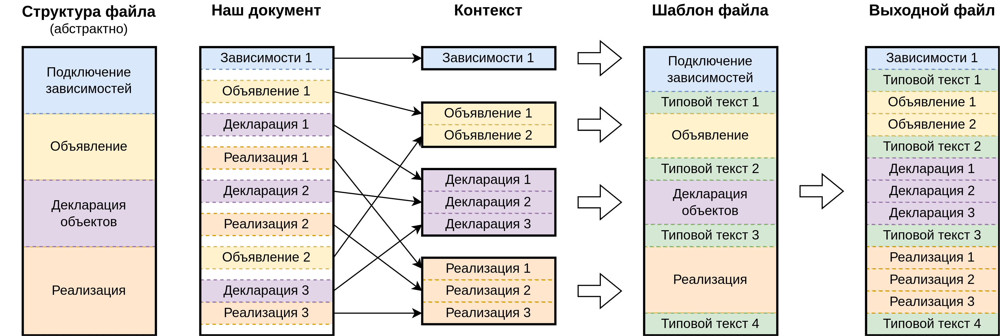

# Список доступных команд

Здесь приведён список команд, которые доступны на данный момент. Информация по приведённым командам будет обновляться по мере развития.

# Общий принцип

Команды вводятся в строке [магии](https://ipython.readthedocs.io/en/stable/interactive/magics.html)

В общем виде используется следующий формат:

- магия строки: `%vdf #<команда> [#аргумент1] [#аргумент...]`
- магия ячейки: `%%vdf #<команда> [#аргумент1] [#аргумент...]`

К примеру:

- `%vdf #build`
- `%%vdf #wave #format-yaml`

При использовании магии ячейки всё остальное содержимое ячейки трактуется как входные данные для команды.

К примеру:

```yaml
%%vdf #wave #format-yaml
signal:
  - name: clk
    wave: p.....|...
  - name: req
    wave: 0.1..0|1.0
  - name: ack
    wave: 1.....|01.
```


# Ввод исходного кода

Команды ввода исходного кода пополняют ту или иную секцию файла, хранящуюся в контексте

> Принцип ввода исходного кода в одной картинке: 

Имя команды соответствует имени пополняемой секции (см. далее в каких типах файлов какие м.б. секции )

К примеру:

```vhdl
%%vdf code-body
s <= v1 + v2;
```

пополняет код для секции `code-body`

Возможно так же пополнение одной командой нескольких секций одновременно чтобы описывать в одной ячейке тесно связанный код из разных секций

К примеру:

```vhdl
%%vdf code
signal clk : std_logic := '0';
---
clk <= not clk after 5 ns;
```

Часть текста ячейки до разделителя `---` пойдёт в секцию `code-declaration`, часть после - в секцию `code-body`

## Секции файлов

### VHDL

#### Файл типа entity-architecture

| Секция | Назначение секции |
|--------|-------------------|
| header-declaration | подключение библиотек и пакетов до объявления entity |
| unit-generics | параметры блока (generic) в объявлении entity |
| unit-interface | интерфейс блока (port) в объявлении entity |
| header-body | подключение библиотек и пакетов до объявления architecture |
| code-declaration | декларативная часть реализации (до begin) |
| code-body | непосредственное описание реализации (после begin) |

# Компиляция

На данный момент осуществляется только с помощью магии строки и без дополнительных параметров компиляции

```yaml
%vdf #build
```

# Симуляция

На данный момент осуществляется только с помощью магии строки и без дополнительных параметров симуляции

```yaml
%vdf #run
```

> При симуляции так же осуществляется и компиляция

> На данный момент симуляция безусловно выполняется в течение 200 нс

# Просмотр результатов

## Основные результаты

В перечень таких результатов сегодня входят сформированные исходные файлы

На данный момент осуществляется только с помощью магии строки и без дополнительных параметров

```yaml
%vdf #show
```

## Временные диаграммы результатов симуляции

```yaml
%%vdf #show-waves
```

В тексте ячейке через словарь в формате YAML указываются параметры выводимых диаграмм

В одной ячейке можно указать параметры для нескольких диаграмм

Первый уровень словаря:

- ключ      - название диаграммы
- значение  - словарь с параметрами вывода диаграммы

Словарь с параметрами вывода диаграммы:

- ключ      - полное иерархическое имя сигнала
- значение  - [формат представления](https://github.com/nanamake/vcd2json?tab=readme-ov-file#module-detail). пустое значение для использования варианта по умолчанию

> на данный момент верхнем уровнем является блок с именем `main`, поэтому иерархические имена всех сигналов указываются с префиксом `main/`

> через специальный ключ `__prefix__` можно указать общую часть иерархического имени сигналов

Пока что для извлечения данных используется пакет [vcd2json](https://github.com/nanamake/vcd2json), который накладывает следующие ограничения:

- первым из сигналов должен быть указан синхросигнал
- Значения остальных сигналов считываются из результатов симуляции по заднему фронту синхросигнала

Пример:

```yaml
%%vdf #show-waves

general:
  __prefix__ : main/
  clk   :
  s     : X
```

# Ввод документации

Данные команды позволяют формировать документацию из текста ячейки

## Диаграммы сигналов

```yaml
%%vdf #wave
```

Для приведения диаграмм сигналов используется популярный [wavedrom](https://wavedrom.com/)

В тексте ячейки указывается описание диаграммы в формате wavedrom (в виде JSON словаря)

Пример:

```yaml
%%vdf #wave
{
'signal': [
  {'name': 'clk', 'wave': 'p.....|...'},
  {'name': 'req', 'wave': '0.1..0|1.0'},
  {},
  {'name': 'ack', 'wave': '1.....|01.'}
]}
```

Так же можно использовать формат YAML, указав это через дополнительный аргумент

```yaml
%%vdf #wave #format-yaml
signal:
  - name: clk
    wave: p.....|...
  - name: req
    wave: 0.1..0|1.0
  - name: ack
    wave: 1.....|01.
```